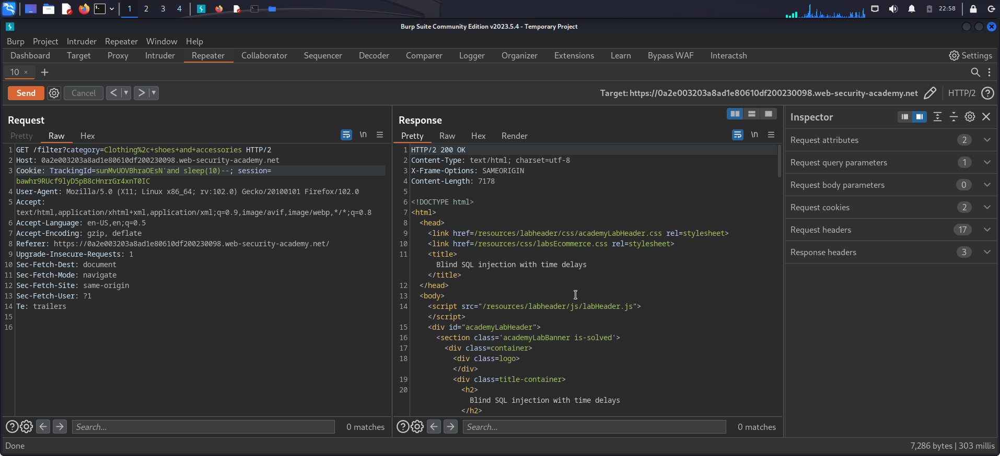
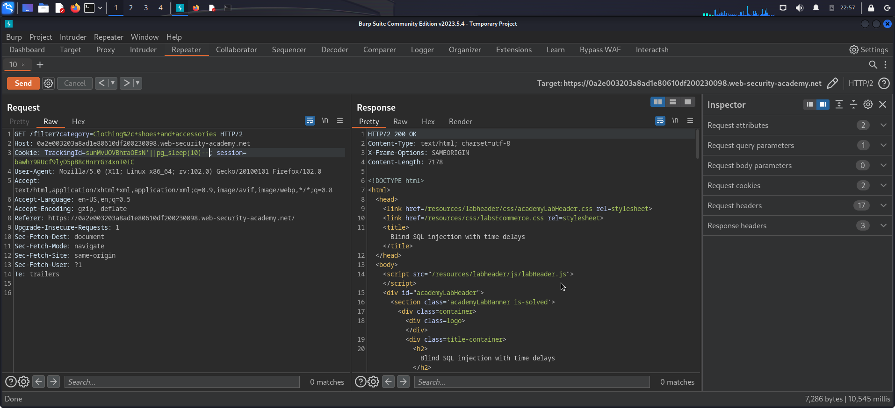

# Blind SQL injection with time delays

## Description

The lap vulnerable to time based sqli in a `TrackingId` cookie which is used in a query but it's result not reflect on the response or even raise error.

## Objectivie

Causing a 10 second time delay.

## Steps

1. As a common testing for sqli i tried to inject special characters or logic conditions but nothing intersting (even that i know that nothing will happen)
   
2. after that i tried the mysql time delay paylaods like `'and sleep(10)--` but the response resieved normally.
3. then i tried the postgreSQL payload `' || pg_sleep(10)--` and look at that it's worked
   
