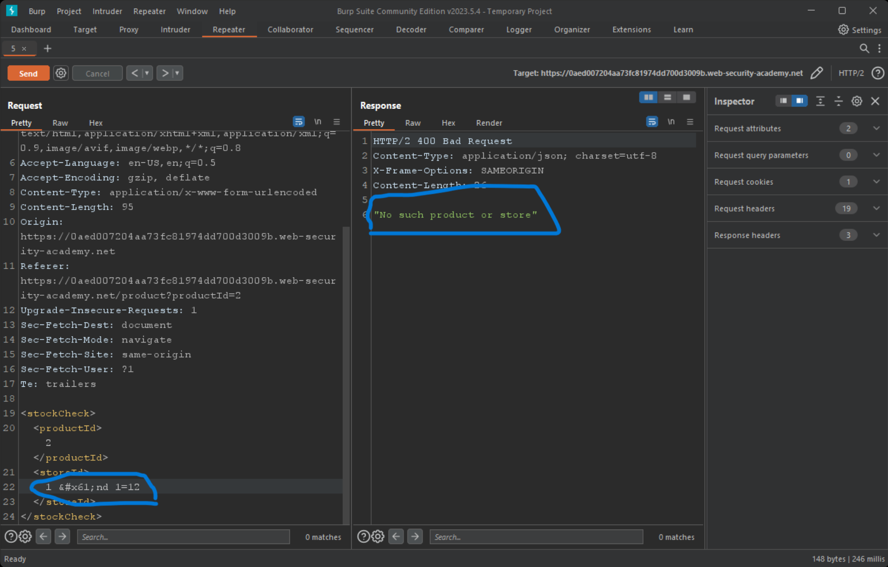

# SQL injection with filter bypass via XML encoding

## Description

This lab contains a SQL injection vulnerability in its `stock check` feature. The results from the query are returned in the application's response, so you can use a `UNION` attack to retrieve data from other tables.

## Objectivie

Retrieve admin's user credentials from `users` table to and login with it.

## Steps

1. first i crawl the app and find the stock check input field
2. but when i intercept the request it makes to understand it's functionality an error raise!!
3. the response is `400 Bad request` with a json message `"XML parsing error"`
4. by observing that the server wait for an xml data and the content-type header `application/xhtml+xml,application/xml;` i tried to make the same request but change the data to xml
   
5. after some tries(Then cheeting from the portswigger learning resource :joy: ) here we are the server accept it.

   

6. injecting any entity of them get's response `"Attack detected"` that's verify that there is a filter
   
7. Detected characters \[`and`,`--`,`select`,`UNION`]
8. inject the same previous data with `"` retrieve `zero unit's` while `/**/` retrieve same data as orginal one that's indicate appending the inputs in a DB query.
9. `#` not detected and not excuted so it's not a `MYSQL` DB nor `ORACLE` because `/**/`accepted
10. `&&` not detected
11. wait a minute as it accept `application/xhtml` we can use html encoding to bypass it.
12. and it's done `1 &#x61;nd 1=12` get `"No such product or store"`
    

    while `1 &#x61;nd 1=1` retrieve it.
    

13. `order by` accepted there is only one column in these query
14. but the good news it's a string datatype `1 &#85;NION &#83;ELECT &apos;x&apos;`
    
15. know it's magic DB is postgresql
    
16. and look at that we retrieve all usernames and passwors in one request `1 &#85;NION &#83;ELECT username||&apos; : &apos;||password from users`
    

## And here we are

