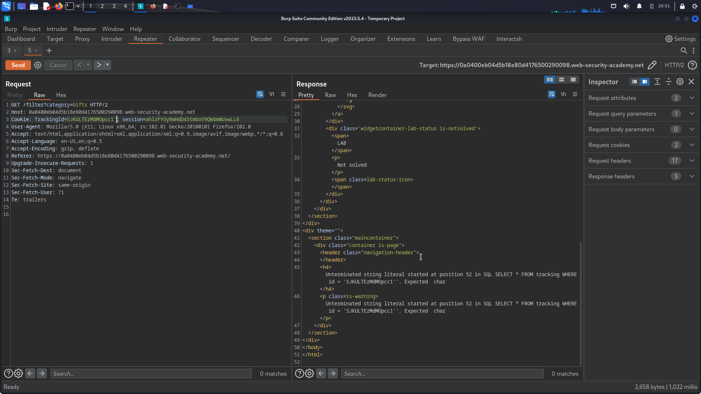
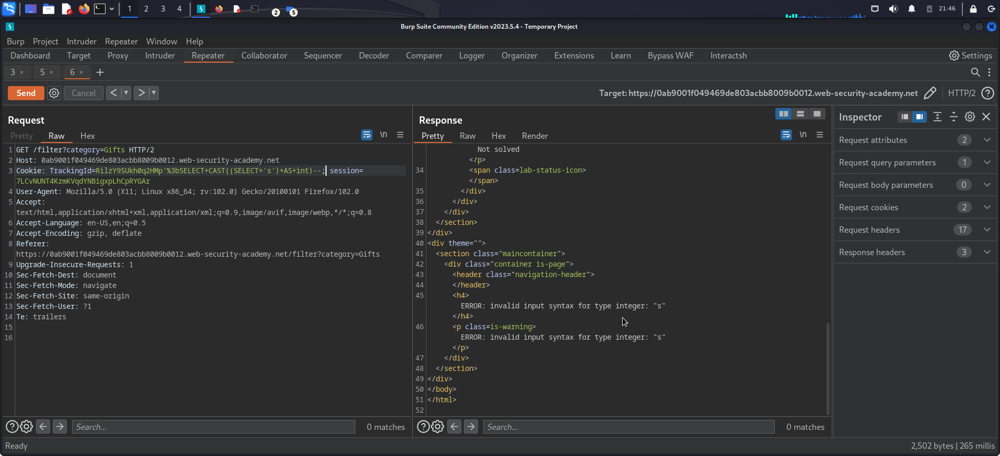
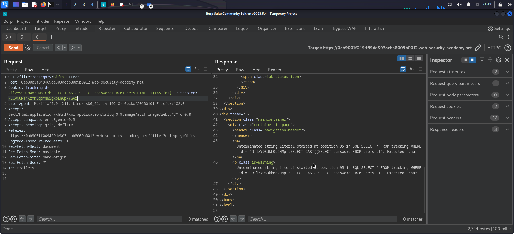
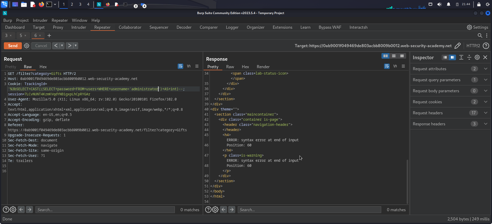
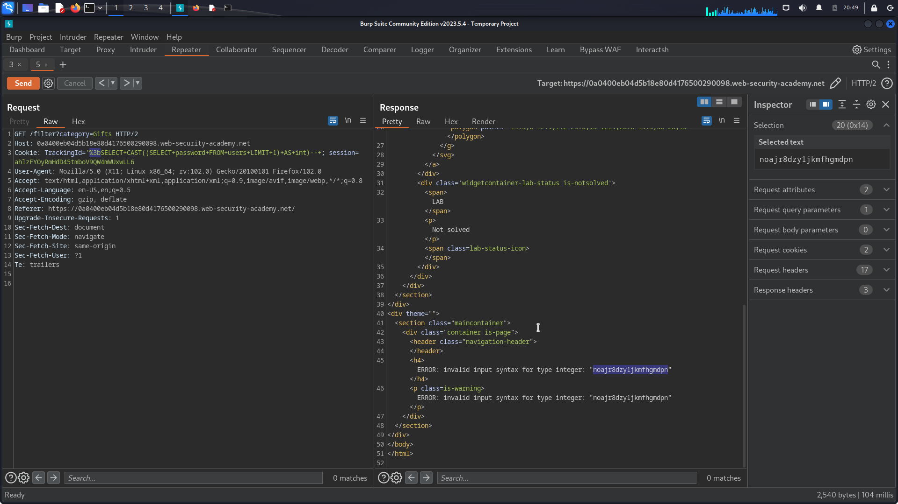
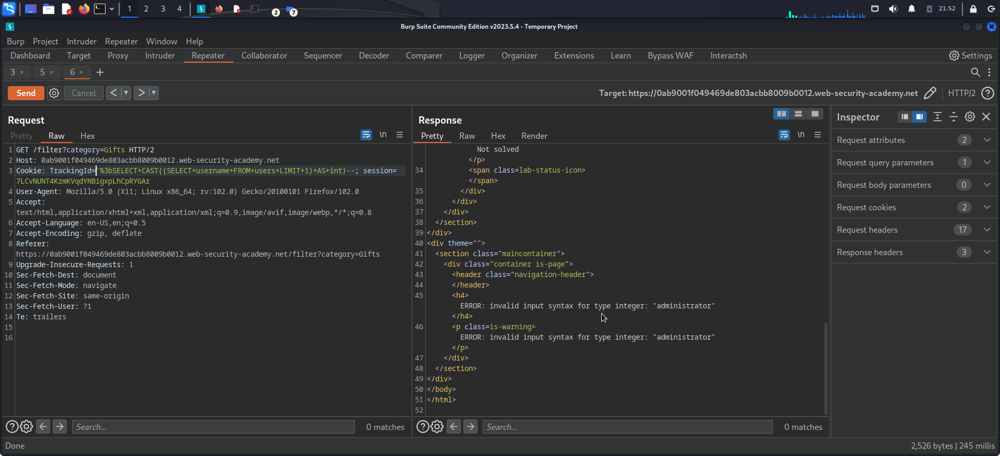

# Virbose Error Based SQLI

## Description

The lap vulnerable to visible error based sqli in a `TrackingId` cookie which is used in a query but it's result not reflect on the response.

## Objectivie

Retrieve the `administrator` password from the `users` table

## Steps

1. first by opening the burpsuite and see the response of the `GET` request made by the Browser there is a `Set-Cookie` header with value `TargetId=jklfasjfsddas`.
2. then i make another request intercept it with the burp and send it repeater to start testing.
3. as all sqli types or testing i first try to add `'` and send the request and look what is happend i resieve a `500 Internal Server Error` response but the most intersting than that, the error reflected on the response body. 
   
4. the error shows that the query used is `SELECT * FROM tracking WHERE id='value'`
   at the first look we may think that it's a Regular Error based sqli but in fact it's not ,because if we try to add a query to retrieve `table_name` for example the response will not reflect so we can't see our query's output.
   we may think to perform Boolean Based sqli or Time Based but let's try these new technique that portswigger add to there academy.
   The mean idea the if we control the query in the backend but only the data we resieve is the error with the cause of that error so we will make the data we want to retrieve is our error.
   example doing `cast((select 'a') as int)` 
   
   we see that the our query output reflects as an error that it can't be an integer.
    
5. the lap tells us that there is `username` and `password` columns in the `users` table hold `administrator` user.
   so the regualer query to use will be `SELECT password FROM users where username='administrator` but when a try it the query does'nt reflect. 
   

6. I tried to remove the `TrackingId` value so the response differs but without the output.
   
7. so i have tried the portswigger cheetsheet payload `cast((select password from users limit 1) as int)` and it worked but still only if i remove the `TrackingId` value i think it some how validata the input length because it worked if i only leave 5 characters but here we are.
   
8. I knew that the first password will be for admin but i cheaked it.
   

9. So we get the password know it's time to solve the lap.
   
10. these technique is much esaire than regualer blind types it still need a script to retrieve all the data in DB but it will be much faster than cheaking for the character one by one i mean it will save alot of time and alot of requests.
